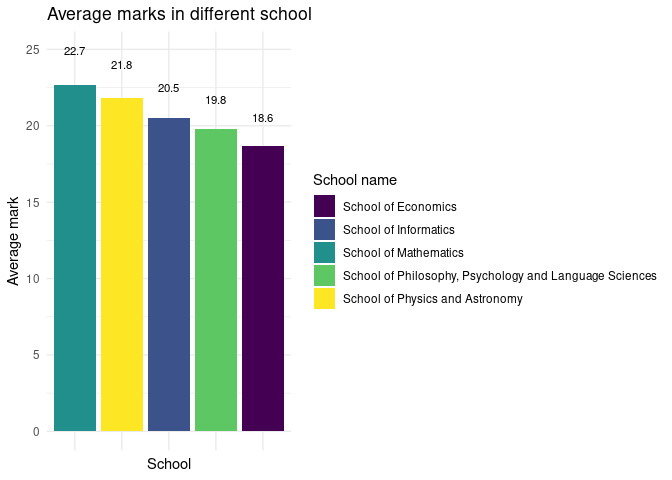
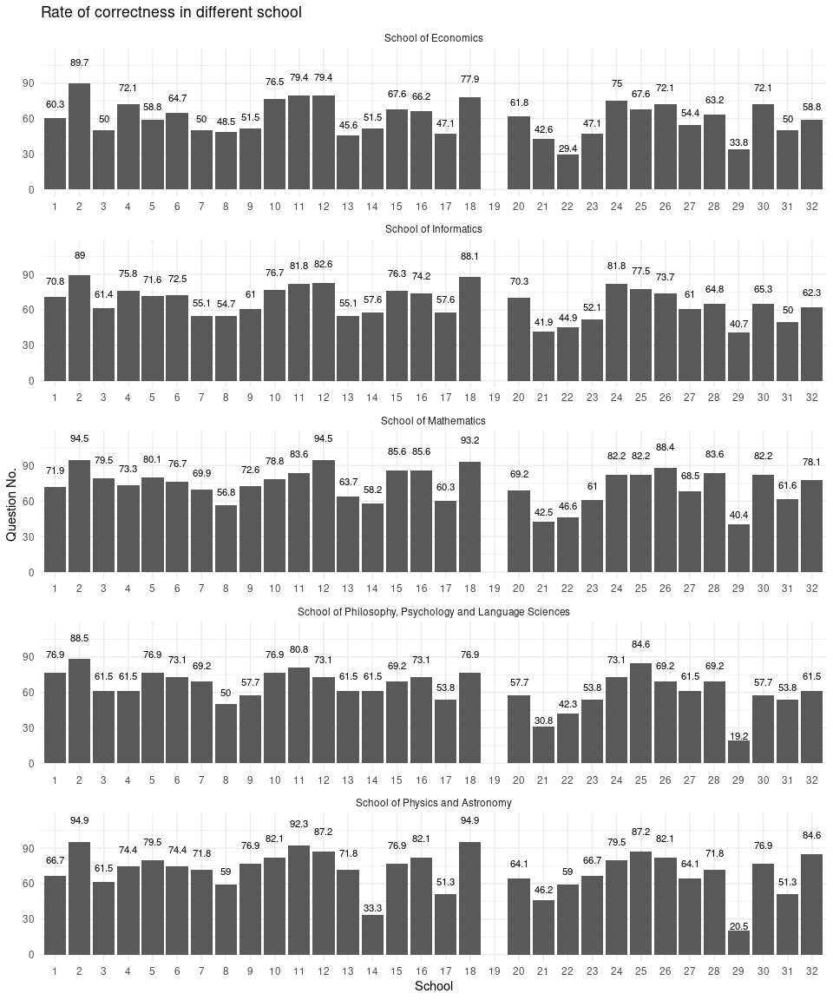
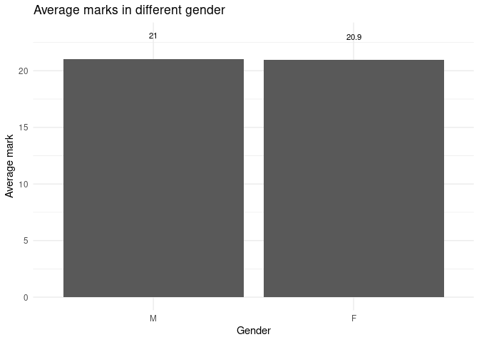
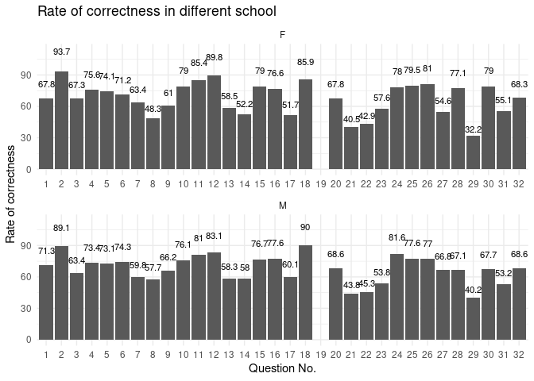

Analysis: Correlations between answers
================
The Mathematicians

## Libraries

``` r
library(tidyverse)
```

    ## ── Attaching packages ─────────────────────────────────────── tidyverse 1.3.1 ──

    ## ✓ ggplot2 3.3.5     ✓ purrr   0.3.4
    ## ✓ tibble  3.1.5     ✓ dplyr   1.0.7
    ## ✓ tidyr   1.1.3     ✓ stringr 1.4.0
    ## ✓ readr   2.0.0     ✓ forcats 0.5.1

    ## ── Conflicts ────────────────────────────────────────── tidyverse_conflicts() ──
    ## x dplyr::filter() masks stats::filter()
    ## x dplyr::lag()    masks stats::lag()

``` r
library(broom)
library(dplyr)
library(patchwork)
library(tidymodels)
```

    ## Registered S3 method overwritten by 'tune':
    ##   method                   from   
    ##   required_pkgs.model_spec parsnip

    ## ── Attaching packages ────────────────────────────────────── tidymodels 0.1.3 ──

    ## ✓ dials        0.0.9      ✓ rsample      0.1.0 
    ## ✓ infer        0.5.4      ✓ tune         0.1.6 
    ## ✓ modeldata    0.1.1      ✓ workflows    0.2.3 
    ## ✓ parsnip      0.1.7      ✓ workflowsets 0.1.0 
    ## ✓ recipes      0.1.16     ✓ yardstick    0.0.8

    ## ── Conflicts ───────────────────────────────────────── tidymodels_conflicts() ──
    ## x scales::discard() masks purrr::discard()
    ## x dplyr::filter()   masks stats::filter()
    ## x recipes::fixed()  masks stringr::fixed()
    ## x dplyr::lag()      masks stats::lag()
    ## x yardstick::spec() masks readr::spec()
    ## x recipes::step()   masks stats::step()
    ## • Use tidymodels_prefer() to resolve common conflicts.

## Load the necesary data

``` r
responses_numeric1_filtered <- read_csv("responses_numeric1_filtered.csv")
```

    ## Rows: 17696 Columns: 12

    ## ── Column specification ────────────────────────────────────────────────────────
    ## Delimiter: ","
    ## chr (9): anon_id, Date, programme_school_name, gender, answer, raw, expected...
    ## dbl (3): qnum, ...7, mark

    ## 
    ## ℹ Use `spec()` to retrieve the full column specification for this data.
    ## ℹ Specify the column types or set `show_col_types = FALSE` to quiet this message.

## Average marks in different schools

We are going to calculate the mark of each student and record their
schools. Also, we are going to discard the schools where only a small
number of people (n \< 5, based on the data we get from the explotatory
analysis) has filled in the survey because the conclusion drawn from
these schools are less likely to be representative.

Then, we are going to create a bar chart showing the average marks of
all selected schools in order to compare them.

``` r
responses_numeric1_filtered %>%
  group_by(anon_id) %>%
  summarise(
    individual_mark = sum(mark, na.rm = TRUE),
    programme_school_name = programme_school_name
  ) %>%
  distinct() %>%
  filter(programme_school_name %in% c(
    "School of Mathematics",
    "School of Informatics",
    "School of Economics",
    "School of Physics and Astronomy",
    "School of Philosophy, Psychology and Language Sciences"
    )
  ) %>%
  group_by(programme_school_name) %>%
  summarise(avg_mark = mean(individual_mark)) %>%
  ggplot(mapping = aes(x = reorder(programme_school_name, -avg_mark), y = avg_mark, fill = programme_school_name)) +
  geom_col() +
  theme_minimal() +
  scale_x_discrete(guide = guide_axis(n.dodge=2)) +
  labs(
    x = "School",
    y = "Average mark",
    title = "Average marks in different school",
    fill = "School name"
  ) +
  theme(axis.text.x = element_blank()) +
  scale_fill_viridis_d() +
  geom_text(mapping = aes(label = signif(avg_mark, digits = 3)), size = 3, position = position_stack(vjust = 1.1))
```

    ## `summarise()` has grouped output by 'anon_id'. You can override using the `.groups` argument.

<!-- -->

## Rate of correctness for each individual questions in different schools

``` r
responses_numeric1_filtered %>%
  filter(programme_school_name %in% c(
    "School of Mathematics",
    "School of Informatics",
    "School of Economics",
    "School of Physics and Astronomy",
    "School of Philosophy, Psychology and Language Sciences"
    )
  ) %>%
  group_by(qnum, programme_school_name) %>%
  summarise(
    percentage_correctness = sum(mark) / n() * 100
    ) %>%
  ggplot(mapping = aes(x = as.factor(qnum), y = percentage_correctness)) +
  geom_col() +
  theme_minimal() +
  scale_y_continuous(limits = c(0, 114)) +
  labs(
    x = "School",
    y = "Question No.",
    title = "Rate of correctness in different school",
    fill = "School name"
  ) +
  facet_wrap(programme_school_name ~ ., ncol = 1, scales = "free") +
  geom_text(mapping = aes(label = signif(percentage_correctness, digits = 3)), size = 3, position = position_stack(vjust = 1.2)) 
```

    ## `summarise()` has grouped output by 'qnum'. You can override using the `.groups` argument.

<!-- -->

As we can see the distribution of correctness rate of different schools
are quite similar. Question 19 is removed because it’s a filter question
and students are instructed to select “agree”.

After that we plan to do the same analysis on gender.

## Average marks in different genders

``` r
responses_numeric1_filtered %>%
  group_by(anon_id) %>%
  summarise(
    individual_mark = sum(mark, na.rm = TRUE),
    gender = gender
  ) %>%
  distinct() %>%
  filter(is.na(gender) == FALSE) %>%
  group_by(gender) %>%
  summarise(avg_mark = mean(individual_mark)) %>%
  ggplot(mapping = aes(x = reorder(gender, -avg_mark), y = avg_mark)) +
  geom_col() +
  theme_minimal() +
  labs(
    x = "Gender",
    y = "Average mark",
    title = "Average marks in different gender",
  ) +
  geom_text(mapping = aes(label = signif(avg_mark, digits = 3)), size = 3, position = position_stack(vjust = 1.1))
```

    ## `summarise()` has grouped output by 'anon_id'. You can override using the `.groups` argument.

<!-- -->

## Rate of correctness for each individual questions in different genders

``` r
responses_numeric1_filtered %>%
  filter(is.na(gender) == FALSE) %>%
  group_by(qnum, gender) %>%
  summarise(
    percentage_correctness = sum(mark) / n() * 100
    ) %>%
  ggplot(mapping = aes(x = as.factor(qnum), y = percentage_correctness)) +
  geom_col() +
  theme_minimal() +
  scale_y_continuous(limits = c(0, 114)) +
  labs(
    x = "Question No.",
    y = "Rate of correctness",
    title = "Rate of correctness in different school",
  ) +
  facet_wrap(gender ~ ., ncol = 1, scales = "free") +
  geom_text(mapping = aes(label = signif(percentage_correctness, digits = 3)), size = 3, position = position_stack(vjust = 1.2)) 
```

    ## `summarise()` has grouped output by 'qnum'. You can override using the `.groups` argument.

    ## Warning: Removed 2 rows containing missing values (position_stack).

    ## Warning: Removed 2 rows containing missing values (position_stack).

<!-- -->

As we can see, the general patterns are also similar. But we can see
that for some questions males did better than females while in some
other questions females did better than males. We are going to find out
these specific questions.

``` r
responses_female <- responses_numeric1_filtered %>%
  filter(is.na(gender) == FALSE) %>%
  group_by(qnum, gender) %>%
  summarise(
    percentage_correctness = sum(mark) / n() * 100
    ) %>%
  filter(gender == "F")
```

    ## `summarise()` has grouped output by 'qnum'. You can override using the `.groups` argument.

``` r
responses_male <- responses_numeric1_filtered %>%
  filter(is.na(gender) == FALSE) %>%
  group_by(qnum, gender) %>%
  summarise(
    percentage_correctness = sum(mark) / n() * 100
    ) %>%
  filter(gender == "M")
```

    ## `summarise()` has grouped output by 'qnum'. You can override using the `.groups` argument.

``` r
difference_marks <- tibble(
  qnum = responses_male$qnum,
  male_mark = responses_male$percentage_correctness,
  female_mark = responses_female$percentage_correctness
) %>%
  mutate(difference = male_mark - female_mark) %>%
  arrange(difference)
print(difference_marks)
```

    ## # A tibble: 32 × 4
    ##     qnum male_mark female_mark difference
    ##    <dbl>     <dbl>       <dbl>      <dbl>
    ##  1    30      67.7        79.0     -11.4 
    ##  2    28      67.1        77.1     -10.0 
    ##  3    12      83.1        89.8      -6.67
    ##  4     2      89.1        93.7      -4.53
    ##  5    11      81.0        85.4      -4.40
    ##  6    26      77.0        81.0      -3.94
    ##  7     3      63.4        67.3      -3.87
    ##  8    23      53.8        57.6      -3.78
    ##  9     7      59.8        63.4      -3.60
    ## 10    10      76.1        79.0      -2.89
    ## # … with 22 more rows

We can see that in question 30 and 28, females did significantly better
while in question 27 and 8 males did significantly better. Question 29
and 17 also shows some differences but are reletively less significant.
