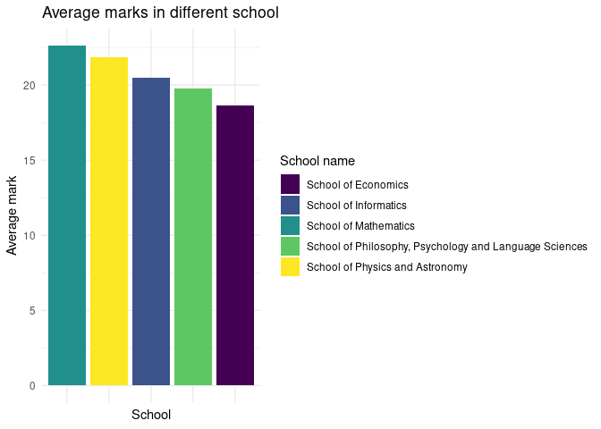

Analysis: Correlations between answers
================
The Mathematicians

## Libraries

``` r
library(tidyverse)
```

    ## ── Attaching packages ─────────────────────────────────────── tidyverse 1.3.1 ──

    ## ✓ ggplot2 3.3.5     ✓ purrr   0.3.4
    ## ✓ tibble  3.1.5     ✓ dplyr   1.0.7
    ## ✓ tidyr   1.1.3     ✓ stringr 1.4.0
    ## ✓ readr   2.0.0     ✓ forcats 0.5.1

    ## ── Conflicts ────────────────────────────────────────── tidyverse_conflicts() ──
    ## x dplyr::filter() masks stats::filter()
    ## x dplyr::lag()    masks stats::lag()

``` r
library(broom)
library(dplyr)
library(patchwork)
library(tidymodels)
```

    ## Registered S3 method overwritten by 'tune':
    ##   method                   from   
    ##   required_pkgs.model_spec parsnip

    ## ── Attaching packages ────────────────────────────────────── tidymodels 0.1.3 ──

    ## ✓ dials        0.0.9      ✓ rsample      0.1.0 
    ## ✓ infer        0.5.4      ✓ tune         0.1.6 
    ## ✓ modeldata    0.1.1      ✓ workflows    0.2.3 
    ## ✓ parsnip      0.1.7      ✓ workflowsets 0.1.0 
    ## ✓ recipes      0.1.16     ✓ yardstick    0.0.8

    ## ── Conflicts ───────────────────────────────────────── tidymodels_conflicts() ──
    ## x scales::discard() masks purrr::discard()
    ## x dplyr::filter()   masks stats::filter()
    ## x recipes::fixed()  masks stringr::fixed()
    ## x dplyr::lag()      masks stats::lag()
    ## x yardstick::spec() masks readr::spec()
    ## x recipes::step()   masks stats::step()
    ## • Use tidymodels_prefer() to resolve common conflicts.

## Load the necesary data

``` r
responses_numeric1_filtered <- read_csv("responses_numeric1_filtered.csv")
```

    ## Rows: 17696 Columns: 12

    ## ── Column specification ────────────────────────────────────────────────────────
    ## Delimiter: ","
    ## chr (9): anon_id, Date, programme_school_name, gender, answer, raw, expected...
    ## dbl (3): qnum, ...7, mark

    ## 
    ## ℹ Use `spec()` to retrieve the full column specification for this data.
    ## ℹ Specify the column types or set `show_col_types = FALSE` to quiet this message.

## Average marks

We are going to calculate the mark of each student and record their
schools. Also, we are going to discard the schools where only a small
number of people (n \< 5, based on the data we get from the explotatory
analysis) has filled in the survey because the conclusion drawn from
these schools are less likely to be representative.

Then, we are going to create a bar chart showing the average marks of
all selected schools in order to compare them.

``` r
responses_numeric1_filtered %>%
  group_by(anon_id) %>%
  summarise(
    individual_mark = sum(mark, na.rm = TRUE),
    programme_school_name = programme_school_name
  ) %>%
  distinct() %>%
  filter(programme_school_name %in% c(
    "School of Mathematics",
    "School of Informatics",
    "School of Economics",
    "School of Physics and Astronomy",
    "School of Philosophy, Psychology and Language Sciences"
    )
  ) %>%
  group_by(programme_school_name) %>%
  summarise(avg_mark = mean(individual_mark)) %>%
  ggplot() +
  geom_col(mapping = aes(x = reorder(programme_school_name, -avg_mark), y = avg_mark, fill = programme_school_name)) +
  theme_minimal() +
  scale_x_discrete(guide = guide_axis(n.dodge=2)) +
  labs(
    x = "School",
    y = "Average mark",
    title = "Average marks in different school",
    fill = "School name"
  ) +
  theme(axis.text.x = element_blank()) +
  scale_fill_viridis_d()
```

    ## `summarise()` has grouped output by 'anon_id'. You can override using the `.groups` argument.

<!-- -->
