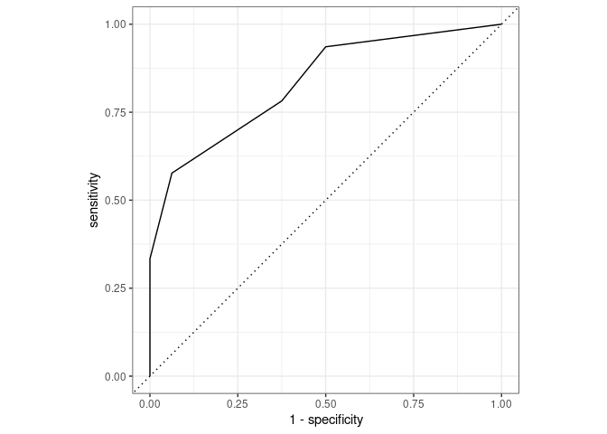
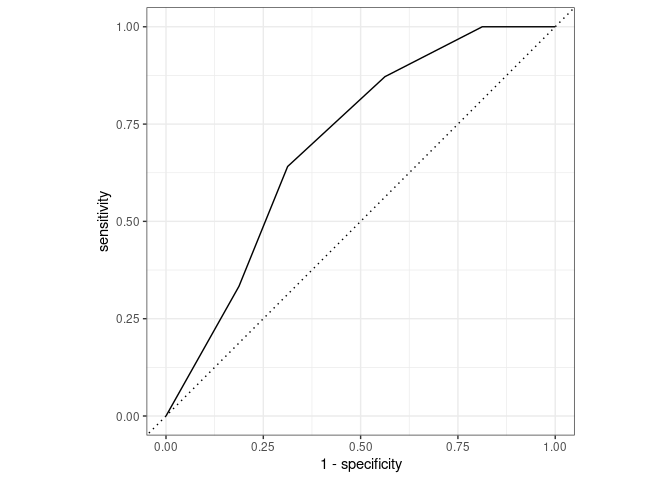

Analysis: Correlations between answers
================
The Mathematicians

## Libraries

``` r
library(tidyverse)
```

    ## ── Attaching packages ─────────────────────────────────────── tidyverse 1.3.1 ──

    ## ✓ ggplot2 3.3.5     ✓ purrr   0.3.4
    ## ✓ tibble  3.1.5     ✓ dplyr   1.0.7
    ## ✓ tidyr   1.1.3     ✓ stringr 1.4.0
    ## ✓ readr   2.0.0     ✓ forcats 0.5.1

    ## ── Conflicts ────────────────────────────────────────── tidyverse_conflicts() ──
    ## x dplyr::filter() masks stats::filter()
    ## x dplyr::lag()    masks stats::lag()

``` r
library(broom)
library(dplyr)
library(patchwork)
library(tidymodels)
```

    ## Registered S3 method overwritten by 'tune':
    ##   method                   from   
    ##   required_pkgs.model_spec parsnip

    ## ── Attaching packages ────────────────────────────────────── tidymodels 0.1.3 ──

    ## ✓ dials        0.0.9      ✓ rsample      0.1.0 
    ## ✓ infer        0.5.4      ✓ tune         0.1.6 
    ## ✓ modeldata    0.1.1      ✓ workflows    0.2.3 
    ## ✓ parsnip      0.1.7      ✓ workflowsets 0.1.0 
    ## ✓ recipes      0.1.16     ✓ yardstick    0.0.8

    ## ── Conflicts ───────────────────────────────────────── tidymodels_conflicts() ──
    ## x scales::discard() masks purrr::discard()
    ## x dplyr::filter()   masks stats::filter()
    ## x recipes::fixed()  masks stringr::fixed()
    ## x dplyr::lag()      masks stats::lag()
    ## x yardstick::spec() masks readr::spec()
    ## x recipes::step()   masks stats::step()
    ## • Use tidymodels_prefer() to resolve common conflicts.

``` r
library(gtools)
```

    ## 
    ## Attaching package: 'gtools'

    ## The following object is masked from 'package:rsample':
    ## 
    ##     permutations

## Load the necesary data

``` r
responses_numeric1_filtered <- read_csv("responses_numeric1_filtered.csv")
```

    ## Rows: 17696 Columns: 12

    ## ── Column specification ────────────────────────────────────────────────────────
    ## Delimiter: ","
    ## chr (9): anon_id, Date, programme_school_name, gender, answer, raw, expected...
    ## dbl (3): qnum, ...7, mark

    ## 
    ## ℹ Use `spec()` to retrieve the full column specification for this data.
    ## ℹ Specify the column types or set `show_col_types = FALSE` to quiet this message.

## Group the data based on their categories

In order to analyse the correlation between answers to questions in
different categories, we need to firstly group the data based on
categories. And during this section of analysis, we are going to use the
data set where scores are given binominally (either 1 or 0) for each
individual question. Also, we still need to discard those who didn’t
finish the whole survey and just completed a part of the questions (as
they are less likely to do the survey seriously).

``` r
not_finish_list <- responses_numeric1_filtered %>%
  filter(is.na(answer) == TRUE) 
not_finish_list <- as_tibble(unique(not_finish_list$anon_id))
not_finish_list <- not_finish_list %>%
  rename(anon_id = value)

responses_part2 <- anti_join(responses_numeric1_filtered, not_finish_list, by = "anon_id")

responses_summary_part2 <- responses_part2 %>%
  filter(qnum != 19) %>%
  group_by(anon_id, category) %>%
  summarise(sum_category_mark = sum(mark))
```

    ## `summarise()` has grouped output by 'anon_id'. You can override using the `.groups` argument.

``` r
responses_summary_part2 <- responses_summary_part2 %>%
  pivot_wider(names_from = category, values_from = sum_category_mark)
```

## Pearson correlation test

Based on the result we obtained above, we could test the correlations
between different marks for different categories. We are going to use
pearson coefficient which can accurately show their level of
correlation. For those with relative high levels of correlation, we
could do deeper investigations.  
We are going to make a matrix where the intercepted entry between each
row and column represents the correlation between the variables
(category) represented by each row and column (Each row and column will
represent a category)

``` r
correlation_matrix <- data.frame(matrix(ncol = 8, nrow = 8))
rownames(correlation_matrix) <- colnames(responses_summary_part2[2:9])
colnames(correlation_matrix) <- colnames(responses_summary_part2[2:9])
for (i in 1:8) {
  for (j in 1:8) {
    x <- responses_summary_part2[i + 1]
    y <- responses_summary_part2[j + 1]
    correlation_matrix[i, j] <- cor(x, y, method = "pearson")
  }
}

correlation_matrix <- correlation_matrix %>%
  select(-c("no_category"))
correlation_matrix <- correlation_matrix[-c(5),]

print(correlation_matrix)
```

    ##                confidence growth_mindset  interest    nature persistence
    ## confidence      1.0000000     0.10132206 0.3189357 0.1614555  0.31464807
    ## growth_mindset  0.1013221     1.00000000 0.1757021 0.2126943  0.08377009
    ## interest        0.3189357     0.17570212 1.0000000 0.2869885  0.29001460
    ## nature          0.1614555     0.21269430 0.2869885 1.0000000  0.23220735
    ## persistence     0.3146481     0.08377009 0.2900146 0.2322073  1.00000000
    ## real_world      0.0755797     0.24514182 0.3658693 0.2243523  0.16293823
    ## sense           0.1910234     0.22272586 0.3671740 0.2991264  0.33047533
    ##                real_world     sense
    ## confidence      0.0755797 0.1910234
    ## growth_mindset  0.2451418 0.2227259
    ## interest        0.3658693 0.3671740
    ## nature          0.2243523 0.2991264
    ## persistence     0.1629382 0.3304753
    ## real_world      1.0000000 0.3416629
    ## sense           0.3416629 1.0000000

It seems that these categories don’t have significant linear
correlations. Therefore, we may need to fit them to a model other than a
simple linear model. And, after some processings, we can change the
value of the column we need to use to be binomial and then we can apply
logistic regression model.

We know that for each individual question, the mark is either 0 or 1 and
each category contains several questions like this. Therefore, the
distribution of total mark of each category is similar to a binomial
distribution. The difference is that in binomial distribution, the
probability of getting each question correctly is fixed while in this
situation the probability may not be fixed.

However, we know that if a student answers each question by pure
guessing, the probability of answering each question correctly will just
be 2/5 (Since “Neutral” will always get a score of 0). Therefore, we
could calculate a “critical number” such that if a student gets a number
of correct answers that is less than the critical number, than the
probability that the student is guessing the answer is more than the
probability that the student is doing these questions seriously.

Based on this, we could turn the total mark of each student into 1 or 0
according to the following rule: If the number of correct answer is
smaller than the “critical number”, we can mark them as 0, otherwise 1.

When it comes to the calculation of critical number, we could simply
find a number “m” for each category such that the probability for the
number of correct answers to be less than “m” is greater than 50% under
the distribution of Bin(n, 1/2) where n is the total number of question
in each category.

For example, if there are 4 question in a category, we can find that
P(Right answer \<= 2) = (1/2)^4 \* (4C0 + 4C1 + 4C2) = 0.6875 while
P(Right answer \<= 1) \< 0.5. In this case, the “critical number” will
be 2.

According to the method of categorising questions described in the
previous section, we can get the following critical number for each
category:

-   Confidence in Mathematics: 2

-   Persistence in Problem Solving: 2

-   Growth Mindset: 2

-   Interest in Mathematics: 1

-   Relationship between Mathematics and Real World: 1

-   Sense Making: 2

-   Nature of the Answers: 3

## Writing the model-fitting function

As there are multiple groups of values that is needed to be fitted, we
decided to create a function in order to prevent writing codes
repetitively.

``` r
model_fitting <- function(responses_binary) {

  #Split the data to training data and testing data
  set.seed(9841)
  data_split <- initial_split(responses_binary, prop = 0.8)
  training_data = training(data_split)
  testing_data = testing(data_split)
    
  
  #Create a recipe
  data_rec <- recipe(
    dep_var ~ indep_var,
    data = training_data
  ) %>%
    step_dummy(all_nominal(), -all_outcomes())
  data_model <- logistic_reg() %>%
    set_engine("glm")
  
  #Create workflow
  data_workflow <- workflow() %>%
    add_model(data_model) %>%
    add_recipe(data_rec)
  data_fit <- data_workflow %>%
    fit(data = training_data)
  
  data_predict <- predict(data_fit, testing_data, type = "prob") %>%
    bind_cols(testing_data)
  
  return(data_predict)
}
```

## Creating ROC matrix

We need to create an ROC matrix in order to find the models that are
worth paying attention by comparing their roc.

``` r
roc_matrix <- data.frame(matrix(ncol = 8, nrow = 8))
rownames(roc_matrix) <- colnames(responses_summary_part2[2:9])
colnames(roc_matrix) <- colnames(responses_summary_part2[2:9])

roc_matrix <- roc_matrix %>%
  select(-c("no_category"))
roc_matrix <- roc_matrix[-c(5),]

variable_matrix <- permutations(
  8, 
  2, 
  v = colnames(responses_summary_part2)[2:9], 
  repeats.allowed = FALSE
  ) %>%
  as_tibble() %>%
  filter(V1 != "no_category" & V2 != "no_category") %>%
  as.matrix() %>%
  t() 
```

    ## Warning: The `x` argument of `as_tibble.matrix()` must have unique column names if `.name_repair` is omitted as of tibble 2.0.0.
    ## Using compatibility `.name_repair`.
    ## This warning is displayed once every 8 hours.
    ## Call `lifecycle::last_lifecycle_warnings()` to see where this warning was generated.

``` r
for (i in 1:42) {
  variable_col <- variable_matrix[i]
  responses_binary <- responses_summary_part2 %>%
    ungroup() %>%
    select(all_of(c(variable_matrix[1,i], variable_matrix[2,i]))) %>%
    mutate(
      dep_var = case_when(
        as.logical(variable_matrix[1,i] == "confidence") ~ if_else(V1 <= 2, 0, 1),
        as.logical(variable_matrix[1,i] == "growth_mindset") ~ if_else(V1 <= 2, 0, 1),
        as.logical(variable_matrix[1,i] == "interest") ~ if_else(V1 <= 1, 0, 1),
        as.logical(variable_matrix[1,i] == "nature") ~ if_else(V1 <= 3, 0, 1),
        as.logical(variable_matrix[1,i] == "persistence") ~ if_else(V1 <= 2, 0, 1),
        as.logical(variable_matrix[1,i] == "real_world") ~ if_else(V1 <= 1, 0, 1),
        as.logical(variable_matrix[1,i] == "sense") ~ if_else(V1 <= 2, 0, 1)
      )
    ) %>%
    mutate(dep_var = as_factor(dep_var)) %>%
    mutate(indep_var = as_factor(V2)) 
  roc_value <- model_fitting(responses_binary) %>%
  roc_auc(
    truth = dep_var,
    .pred_1,
    event_level = "second"
  )
  roc_matrix[variable_matrix[1,i], variable_matrix[2,i]] <- roc_value$.estimate
}
```

## Find models that are worth paying attention

First, let’s take a look at the ROC matrix. The rows of the matrix
represent dependent variables and rows represent independent variables.

``` r
print(roc_matrix)
```

    ##                confidence growth_mindset  interest    nature persistence
    ## confidence             NA      0.5559330 0.6503623 0.4759964   0.6682518
    ## growth_mindset  0.6287594             NA 0.6456767 0.5963346   0.5404135
    ## interest        0.8321314      0.5228365        NA 0.5709135   0.5849359
    ## nature          0.6053276      0.6169626 0.5979792        NA   0.6132884
    ## persistence     0.6839945      0.5013680 0.5738714 0.6251710          NA
    ## real_world      0.5038402      0.6349206 0.6740911 0.5780850   0.5033282
    ## sense           0.6291062      0.6172651 0.5832697 0.5840336   0.6348358
    ##                real_world     sense
    ## confidence      0.4934330 0.5903533
    ## growth_mindset  0.6463816 0.6139568
    ## interest        0.6698718 0.7027244
    ## nature          0.6604409 0.6429884
    ## persistence     0.4778842 0.5875513
    ## real_world             NA 0.6833077
    ## sense           0.6760886        NA

We can see that the area under the ROC curve when interest is the
dependent variable and confidence is the independent variable is
0.8321314, which is the highest in the matrix. So we will take a look at
the model.

``` r
responses_interest_confidence <- responses_summary_part2 %>%
  ungroup() %>%
  select(interest, confidence) %>%
  mutate(
    interest = as_factor(if_else(interest <= 1, 0, 1)),
    confidence = as_factor(confidence)
  ) 

set.seed(9841)
interest_confidence_split <- initial_split(responses_interest_confidence, prop = 0.8)
interest_confidence_training_data = training(interest_confidence_split)
interest_confidence_testing_data = testing(interest_confidence_split)
interest_confidence_rec <- recipe(
  interest ~ confidence,
  data = interest_confidence_training_data
) %>%
  step_dummy(all_nominal(), -all_outcomes())
interest_confidence_model <- logistic_reg() %>%
  set_engine("glm")
interest_confidence_workflow <- workflow() %>%
  add_model(interest_confidence_model) %>%
  add_recipe(interest_confidence_rec)
interest_confidence_fit <- interest_confidence_workflow %>%
  fit(data = interest_confidence_training_data)
tidy(interest_confidence_fit)
```

    ## # A tibble: 5 × 5
    ##   term          estimate std.error statistic    p.value
    ##   <chr>            <dbl>     <dbl>     <dbl>      <dbl>
    ## 1 (Intercept)     -0.201     0.449    -0.446 0.655     
    ## 2 confidence_X1    1.35      0.544     2.47  0.0134    
    ## 3 confidence_X2    1.68      0.533     3.16  0.00159   
    ## 4 confidence_X3    2.41      0.559     4.31  0.0000166 
    ## 5 confidence_X4    2.80      0.580     4.83  0.00000134

<Interpretation>

Also, we could show its ROC to see how the sensitivity and specificity
compares.

``` r
predict(interest_confidence_fit, interest_confidence_testing_data, type = "prob") %>%
  bind_cols(interest_confidence_testing_data) %>%
  roc_curve(
    truth = interest,
    .pred_1,
    event_level = "second"
  ) %>%
  autoplot()
```

<!-- -->

In addition to these two variables, “interest” (dependent variable) and
“sense” (independent variable) also shows a large area under the ROC. We
will also take a look at their model.

``` r
responses_interest_sense <- responses_summary_part2 %>%
  ungroup() %>%
  select(interest, sense) %>%
  mutate(
    interest = as_factor(if_else(interest <= 1, 0, 1)),
    sense = as_factor(sense)
  ) 

set.seed(9841)
interest_sense_split <- initial_split(responses_interest_sense, prop = 0.8)
interest_sense_training_data = training(interest_sense_split)
interest_sense_testing_data = testing(interest_sense_split)
interest_sense_rec <- recipe(
  interest ~ sense,
  data = interest_sense_training_data
) %>%
  step_dummy(all_nominal(), -all_outcomes())
interest_sense_model <- logistic_reg() %>%
  set_engine("glm")
interest_sense_workflow <- workflow() %>%
  add_model(interest_sense_model) %>%
  add_recipe(interest_sense_rec)
interest_sense_fit <- interest_sense_workflow %>%
  fit(data = interest_sense_training_data)
tidy(interest_sense_fit)
```

    ## # A tibble: 6 × 5
    ##   term        estimate std.error statistic p.value
    ##   <chr>          <dbl>     <dbl>     <dbl>   <dbl>
    ## 1 (Intercept)    -1.10      1.15    -0.951 0.341  
    ## 2 sense_X1        1.50      1.27     1.18  0.236  
    ## 3 sense_X2        2.15      1.24     1.74  0.0820 
    ## 4 sense_X3        2.30      1.19     1.94  0.0521 
    ## 5 sense_X4        3.29      1.19     2.76  0.00579
    ## 6 sense_X5        3.42      1.20     2.86  0.00429

<Interpretation>

Also, we could show its ROC to see how the sensitivity and specificity
compares.

``` r
predict(interest_sense_fit, interest_sense_testing_data, type = "prob") %>%
  bind_cols(interest_sense_testing_data) %>%
  roc_curve(
    truth = interest,
    .pred_1,
    event_level = "second"
  ) %>%
  autoplot()
```

<!-- -->
