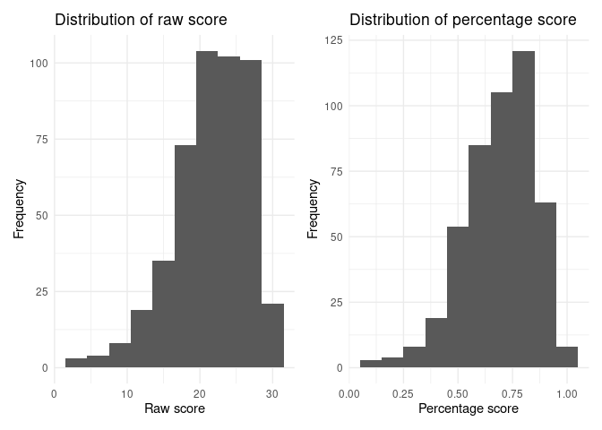
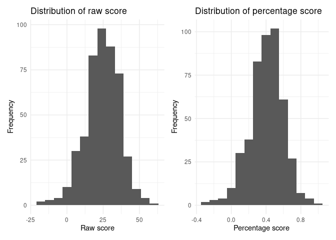

Analysis: Expert-like scores
================
The Mathematicians

## Libraries

``` r
library(tidyverse)
```

    ## ── Attaching packages ─────────────────────────────────────── tidyverse 1.3.1 ──

    ## ✓ ggplot2 3.3.5     ✓ purrr   0.3.4
    ## ✓ tibble  3.1.5     ✓ dplyr   1.0.7
    ## ✓ tidyr   1.1.3     ✓ stringr 1.4.0
    ## ✓ readr   2.0.0     ✓ forcats 0.5.1

    ## ── Conflicts ────────────────────────────────────────── tidyverse_conflicts() ──
    ## x dplyr::filter() masks stats::filter()
    ## x dplyr::lag()    masks stats::lag()

``` r
library(broom)
library(dplyr)
library(patchwork)
```

## Load the necesary data

``` r
responses_numeric1_filtered <- read_csv("responses_numeric1_filtered.csv")
```

    ## Rows: 17696 Columns: 12

    ## ── Column specification ────────────────────────────────────────────────────────
    ## Delimiter: ","
    ## chr (9): anon_id, Date, programme_school_name, gender, answer, raw, expected...
    ## dbl (3): qnum, ...7, mark

    ## 
    ## ℹ Use `spec()` to retrieve the full column specification for this data.
    ## ℹ Specify the column types or set `show_col_types = FALSE` to quiet this message.

``` r
responses_numeric2_filtered <- read_csv("responses_numeric2_filtered.csv")
```

    ## Rows: 17696 Columns: 12

    ## ── Column specification ────────────────────────────────────────────────────────
    ## Delimiter: ","
    ## chr (9): anon_id, Date, programme_school_name, gender, answer, raw, expected...
    ## dbl (3): qnum, ...7, mark

    ## 
    ## ℹ Use `spec()` to retrieve the full column specification for this data.
    ## ℹ Specify the column types or set `show_col_types = FALSE` to quiet this message.

## Analysis Part 1: “Expert-like” scores for each student and result analysis

In this section we are going to calculate an “expert-like” score for
each student and investigate their distribution. Since we have used two
methods to assign numeric values to their answers, we will create two
visualisation. Also, we are going to analyse their results (e.g. the
rate of “correctness” for each question etc.)

In the section we will only consider students who completed the whole
survey (excluding those who only finished parts of the survey).

First we shall see the visualisation generated from the first method
(Each student will get 1 mark for answering the question at a direction
that is the same as the direction of the expected answer and 0
otherwise).

``` r
not_finish_list <- responses_numeric1_filtered %>%
  filter(is.na(answer) == TRUE) 
not_finish_list <- as_tibble(unique(not_finish_list$anon_id))
not_finish_list <- not_finish_list %>%
  rename(anon_id = value)
responses_numeric1_part1 <- anti_join(responses_numeric1_filtered, not_finish_list, by = "anon_id")
```

By the code above, we have obtained the dataset
`responses_numeric1_part1` that include only those who finished the
whole survey.  
After that, we need to calculate the score for each student. Each
student will have a raw score, which is just the sum of the mark they
obtained and a percentage score which is the raw score divided by 31
(total number of questions excluding consent and filter question).  
Then, based on these scores, we will create to plots that show the
distribution of both raw score and percentage score.

``` r
responses_numeric1_summary_part1 <- responses_numeric1_part1 %>%
  filter(qnum != 19) %>%
  group_by(anon_id) %>%
  summarise(raw_score = sum(mark), percentage_score = sum(mark)/31)
plot_raw_1 <- ggplot(data = responses_numeric1_summary_part1) +
  geom_histogram(mapping = aes(x = raw_score), binwidth = 3) +
  theme_minimal() +
  labs(
    title = "Distribution of raw score",
    x = "Raw score",
    y = "Frequency"
  )
plot_percentage_1 <- ggplot(data = responses_numeric1_summary_part1) +
  geom_histogram(mapping = aes(x = percentage_score), binwidth = 0.1) +
  theme_minimal() +
  labs(
    title = "Distribution of percentage score",
    x = "Percentage score",
    y = "Frequency"
  )
plot_raw_1 + plot_percentage_1
```

<!-- -->
<Insert interpretation>

Then we can see the visualisation generated from the second method of
assigning numeric values: for questions of which expected answers are
“Agree”, we could give marks for “Strongly Agree”, “Agree”, “Neutral”,
“Disagree” and “Strongly Disagree” as followed: 2, 1, 0, -1, -2. Vice
versa for questions of which expected answers are “Disagree”.

``` r
not_finish_list <- responses_numeric2_filtered %>%
  filter(is.na(answer) == TRUE) 
not_finish_list <- as_tibble(unique(not_finish_list$anon_id))
not_finish_list <- not_finish_list %>%
  rename(anon_id = value)
responses_numeric2_part1 <- anti_join(responses_numeric2_filtered, not_finish_list, by = "anon_id")
```

By the code above, we have obtained the dataset
`responses_numeric1_part2` that include only those who finished the
whole survey.  
After that, we need to calculate the score for each student. Each
student will have a raw score, which is just the sum of the mark they
obtained and a percentage score which is the raw score divided by 31 \*
2=62 (maximum score that can be obtained by each stuent).  
Then, based on these scores, we will create to plots that show the
distribution of both raw score and percentage score.

``` r
responses_numeric2_summary_part1 <- responses_numeric2_part1 %>%
  filter(qnum != 19) %>%
  group_by(anon_id) %>%
  summarise(raw_score = sum(mark), percentage_score = sum(mark)/62)
plot_raw_2 <- ggplot(data = responses_numeric2_summary_part1) +
  geom_histogram(mapping = aes(x = raw_score), binwidth = 6) +
  theme_minimal() +
  labs(
    title = "Distribution of raw score",
    x = "Raw score",
    y = "Frequency"
  )
plot_percentage_2 <- ggplot(data = responses_numeric2_summary_part1) +
  geom_histogram(mapping = aes(x = percentage_score), binwidth = 0.1) +
  theme_minimal() +
  labs(
    title = "Distribution of percentage score",
    x = "Percentage score",
    y = "Frequency"
  )
plot_raw_2 + plot_percentage_2
```

<!-- -->
The degree of correlation of a strongly agree by a student with respect
to the agree of an expert is exactly the same of a normal agree, because
the expert could be agreeing in any of the two ways, so the most
sensible thing to do is to consider the expert agree as an average of a
student strongly agree and a student normal agree.
