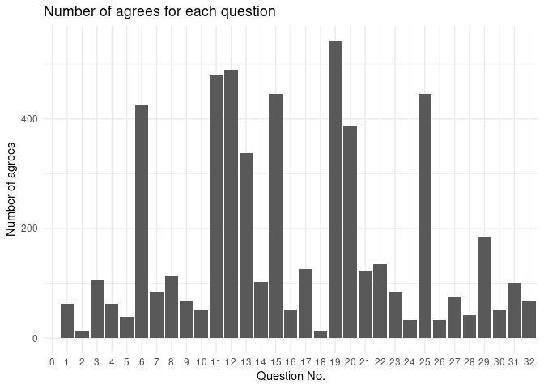

Data Processing and Cleaning
================
The Mathematicians

## Libraries

``` r
library(tidyverse)
```

    ## ── Attaching packages ─────────────────────────────────────── tidyverse 1.3.1 ──

    ## ✓ ggplot2 3.3.5     ✓ purrr   0.3.4
    ## ✓ tibble  3.1.5     ✓ dplyr   1.0.7
    ## ✓ tidyr   1.1.3     ✓ stringr 1.4.0
    ## ✓ readr   2.0.0     ✓ forcats 0.5.1

    ## ── Conflicts ────────────────────────────────────────── tidyverse_conflicts() ──
    ## x dplyr::filter() masks stats::filter()
    ## x dplyr::lag()    masks stats::lag()

``` r
library(broom)
library(dplyr)
library(patchwork)
```

## Load the necesary data

These are the same data set but with different pivoting methods.
Dependent on the task, different methods are needed to be used.

``` r
responses_joined <- read_csv("responses_joined.csv")
```

    ## Rows: 677 Columns: 37

    ## ── Column specification ────────────────────────────────────────────────────────
    ## Delimiter: ","
    ## chr (37): anon_id, Date, Q0, Q1, Q2, Q3, Q4, Q5, Q6, Q7, Q8, Q9, Q10, Q11, Q...

    ## 
    ## ℹ Use `spec()` to retrieve the full column specification for this data.
    ## ℹ Specify the column types or set `show_col_types = FALSE` to quiet this message.

``` r
responses_joined_completed <- read_csv("responses_joined_completed.csv")
```

    ## New names:
    ## * ...1 -> ...7

    ## Rows: 22341 Columns: 10

    ## ── Column specification ────────────────────────────────────────────────────────
    ## Delimiter: ","
    ## chr (8): anon_id, Date, programme_school_name, gender, answer, raw, expected...
    ## dbl (2): qnum, ...7

    ## 
    ## ℹ Use `spec()` to retrieve the full column specification for this data.
    ## ℹ Specify the column types or set `show_col_types = FALSE` to quiet this message.

``` r
expected_answer <- read_csv("maps_questions_processed.csv")
```

    ## New names:
    ## * `` -> ...1

    ## Rows: 32 Columns: 5

    ## ── Column specification ────────────────────────────────────────────────────────
    ## Delimiter: ","
    ## chr (3): raw, expected_ans, qtext
    ## dbl (2): ...1, qnum

    ## 
    ## ℹ Use `spec()` to retrieve the full column specification for this data.
    ## ℹ Specify the column types or set `show_col_types = FALSE` to quiet this message.

## Exploratory Data Analysis (Not finished yet. More analysis needed)

We are going to do some exploratory data analysis to get a general
understanding of data.

1.  Number of students in different schools. By checking the number of
    students in different schools, we are able to get some knowledge on
    the reliability of our results. This is because if a school has a
    very small sample size, then the conclusion about this school
    generated from these samples may not be reliable.

``` r
responses_joined %>%
  filter(is.na(programme_school_name) == FALSE) %>%
  count(programme_school_name) %>%
  arrange(desc(n))
```

    ## # A tibble: 16 × 2
    ##    programme_school_name                                      n
    ##    <chr>                                                  <int>
    ##  1 School of Informatics                                    270
    ##  2 School of Mathematics                                    157
    ##  3 School of Economics                                       80
    ##  4 School of Physics and Astronomy                           41
    ##  5 School of Philosophy, Psychology and Language Sciences    26
    ##  6 Business School                                            4
    ##  7 School of Engineering                                      4
    ##  8 School of Biological Sciences                              2
    ##  9 School of Chemistry                                        2
    ## 10 School of Literatures, Languages and Cultures              2
    ## 11 School of Social and Political Science                     2
    ## 12 College of Arts, Humanities and Social Sciences            1
    ## 13 Edinburgh College of Art                                   1
    ## 14 Moray House School of Education and Sport                  1
    ## 15 School of Divinity                                         1
    ## 16 School of Geosciences                                      1

As we can see, the majority of people who did the survey are from the
following schools: School of Informatics, School of Mathematics, School
of Economics and School of Physics and Astronomy. So the conclusions
about these schools may be more representative.

2.  Number of agrees for each question It’s good to take a quick look at
    how many agrees are there for each question. This could help us
    judge whether there is any pattern for answers to distribute.

``` r
responses_joined_completed %>%
  group_by(qnum) %>%
  summarise(agrees = sum(answer %in% c("Strongly Agree", "Agree"), na.rm = TRUE)) %>%
  arrange(desc(agrees)) %>%
  ggplot() +
  geom_col(mapping = aes(x = factor(qnum), y = agrees)) +
  labs(
    x = "Question No.",
    y = "Number of agrees",
    title = "Number of agrees for each question"
  ) +
  theme_minimal()
```

<!-- -->

According to the plot, there may by no significant general pattern.
Therefore, we may need to analyse the answers question by question or
based on categories of the questions.

Not finished yet… More to be added…

## Categorising questions (Not finished yet. Explanations to each categories are needed)

The methodology of our project is based on the research “The Mathematics
Attitudes and Perceptions Survey: an instrument to assess expert-like
views and dispositions among undergraduate mathematics students” by
Warren Code et al.  
In their research they put each questions into the following
categories:  
- Confidence in Mathematics: Questions No.1, 14, 17, 20

-   Persistence in Problem Solving: Questions No.8, 10, 24, 29

-   Growth Mindset: Question No.5, 6, 22, 31

-   Interest in Mathematics: Question No.12, 26, 32

-   Relationship between Mathematics and Real World: Question No.13, 15,
    21

-   Sense Making: Question No.3, 4, 11, 18, 23

-   Nature of the Answers: Question No.2, 7, 9, 16, 28, 30

-   No category: Question No.25, 27

``` r
responses_joined_completed <- responses_joined_completed %>%
  mutate(category = case_when(
    qnum %in% c(1, 14, 17, 20) ~ "confidence",
    qnum %in% c(8, 10, 24, 29) ~ "persistence",
    qnum %in% c(5, 6, 22, 31) ~ "growth_mindset",
    qnum %in% c(12, 26, 32) ~ "interest",
    qnum %in% c(13, 15, 21) ~ "real_world",
    qnum %in% c(3, 4, 11, 18, 23) ~ "sense",
    qnum %in% c(2, 7, 9, 16, 28, 30) ~ "nature",
    qnum %in% c(25, 27) ~ "no_category",
    qnum == 0 ~ "consent",
    qnum == 19 ~ "filter"
  ))
```

## Assign a numeric value for answers

Each student will get 1 mark for answering the question at a direction
that is the same as the direction of the expected answer and 0
otherwise. For example, if the expected answer is “Agree” then both
“Agree” and “Strongly Agree” will be counted as 1 mark and
’Neutral“,”Disagree“,”Strongly Disagree" will be counted as 0.  
There are different methods of assigning numeric values to these
categorical variables, for instance, for questions of which expected
answers are “Agree”, we could give marks for “Strongly Agree”, “Agree”,
“Neutral”, “Disagree” and “Strongly Disagree” as followed: 2, 1, 0, -1,
-2.  
These different methods would both be applied and corresponding
visualisations would be created. Then we are going to compare which one
yields a better visualisation.

``` r
responses_joined_numeric_1 <- responses_joined_completed %>%
  mutate(mark = case_when(
    expected_ans == "Disagree" ~ if_else(
      answer %in% c("Disagree", "Strongly Disagree"), 1, 0
      ),
    expected_ans == "Agree" ~ if_else(
      answer %in% c("Agree", "Strongly Agree"), 1, 0
      )
    )
  )
```

There are different methods of assigning numeric values to these
categorical variables, for instance, for questions of which expected
answers are “Agree”, we could give marks for “Strongly Agree”, “Agree”,
“Neutral”, “Disagree” and “Strongly Disagree” as followed: 2, 1, 0, -1,
-2.  
These different methods would both be applied and corresponding
visualisations would be created. Then we are going to compare which one
yields a better visualisation.

``` r
responses_joined_numeric_2 <- responses_joined_completed %>%
  mutate(mark = case_when(
    expected_ans == "Agree" ~ case_when(
      answer == "Strongly Agree" ~ 2,
      answer == "Agree" ~ 1,
      answer == "Neutral" ~ 0,
      answer == "Disagree" ~ -1,
      answer == "Strongly Disagree" ~ -2
    ),
    expected_ans == "Disagree" ~ case_when(
      answer == "Strongly Agree" ~ -2,
      answer == "Agree" ~ -1,
      answer == "Neutral" ~ 0,
      answer == "Disagree" ~ 1,
      answer == "Strongly Disagree" ~ 2
    )
  ))
```

## Cleaning data for analysis preparation

For both data sets with different methods of assigning marks, in order
to perform analyses, we must first discarded those who refused to
provide consents. Because if they didn’t provide consent, we can’t have
access to their data. This will be shown as “NA” with which analysis and
visualisation can’t be performed.

``` r
no_consent_list <- responses_joined_completed %>%
  filter(qnum == 0 & answer == "No, I do not consent")
responses_numeric1_filtered <- anti_join(responses_joined_numeric_1, no_consent_list, by = "anon_id")
responses_numeric2_filtered <- anti_join(responses_joined_numeric_2, no_consent_list, by = "anon_id")
```

Then we remove all question 0 asking for consent as it has done its job.
After, we consider question 19. Question 19 is a filter statement, it
says “We use this statement to discard the survey of people who are not
reading the questions. Please select Agree (not Strongly Agree) for this
question”. Therefore, we should discard all people who didn’t select
“Agree” in order to get a better representation of the population.

``` r
responses_numeric1_filtered <- responses_numeric1_filtered %>%
  filter(qnum != 0)
responses_numeric2_filtered <- responses_numeric2_filtered %>%
  filter(qnum != 0)
```

After that, we consider question 19. Question 19 is a filter statement,
it says “We use this statement to discard the survey of people who are
not reading the questions. Please select Agree (not Strongly Agree) for
this question”. Therefore, we should discard all people who didn’t
select “Agree” in order to get a better representation of the
population.

``` r
not_reading_list <- responses_numeric1_filtered %>%
  filter(qnum == 19 & answer != "Agree") 
responses_numeric1_filtered <- anti_join(responses_numeric1_filtered, not_reading_list, by = "anon_id")
responses_numeric2_filtered <- anti_join(responses_numeric2_filtered, not_reading_list, by = "anon_id")
write_csv(responses_numeric1_filtered, file = "responses_numeric1_filtered.csv")
write_csv(responses_numeric2_filtered, file = "responses_numeric2_filtered.csv")
```

After we finished the data cleaning, we are going to store these data
sets for the analysis part.
