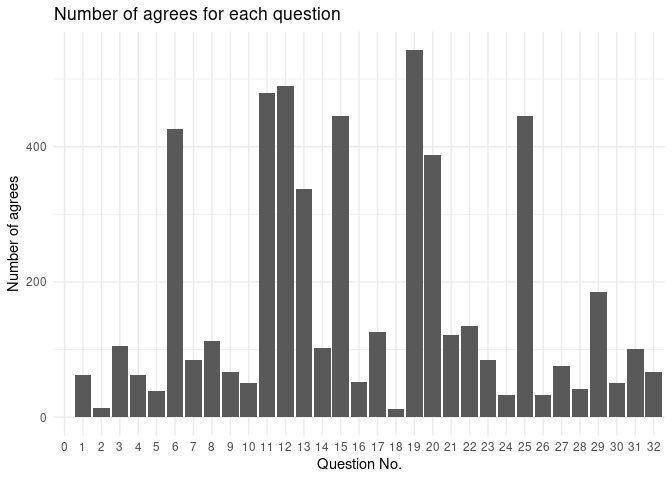

Project proposal
================
The mathematician

``` r
library(tidyverse)
library(broom)
library(dplyr)
```

*For instructions on what each section should include, please see the
[project page](https://idsed.digital/assessments/project/#proposal) on
the course website. Remove this text when completing your proposal*.

## 1. Introduction

This data analysis is based on the research project of Dr. George
Kinnear (which is also where we get our data). The data is collected
from an anonymous survey about “beliefs about mathematics” which is done
by students in the School of Mathematics (including both students in the
School of Mathematics or have School of Mathematics as their second
school) of the University of Edinburgh in 2019/20.

Our research aims at investigating the beliefs of students toward
mathematics. There are serveral sub-questions, which include:  
1. How answers are distributed between students in different schools
(e.g. School of Mathematics vs. School of Informatics)?  
2. Are there any correlations between answers (e.g. whether some
combinations of answers to different questions are more likely to be
chosen simultaneously)?  
3. What are the general attitudes of all students toward mathematics?  
4. How is the answers from students differ from expected answers?  
…etc.

There are 2 raw data which is needed to be processed. Each of them
contains different cases and variables.  
1. responses\_joined (Main data to be analysed)  
The cases are answers to each survey question filled by each
student.There are 22341 cases. The original form of the data contains
677 cases and the answer to each question is given by a separate column.
Therefore it has 37 variables. The original form will also be used
during the analysis process. The reason why the original form is changed
to this form is that we need to satisfy the requirement which limits the
variable number to 10.  
There are 10 variables, these include:  
- `anon_id`: The unique ID generated for each survey filled by student  
- `Date`: The date when student completed the survey  
- `programme_school_name`: The school which the student belong to  
- `gender`: The gender of the student  
- `answer`: The answer to each question (Agree, Strongly Agree, Neutral,
Disagree, Strongly Disagree)  
- `qnum`: The number of question (32 questions in total and 1 extra
question asking for consent)  
- `...7`: An index automatically generated by R for each question  
- `raw` : Shows how the question is presented in the original survey  
- `expected_ans`: The expected answer to each question given by
experts  
- `qtext`: The descriptive of each question (A part of `raw`)  
So there are 10 columns and 22341 rows.

## 2. Data

    ## New names:
    ## * ...1 -> ...7

    ## Rows: 22341 Columns: 10

    ## ── Column specification ────────────────────────────────────────────────────────
    ## Delimiter: ","
    ## chr (8): anon_id, Date, programme_school_name, gender, answer, raw, expected...
    ## dbl (2): qnum, ...7

    ## 
    ## ℹ Use `spec()` to retrieve the full column specification for this data.
    ## ℹ Specify the column types or set `show_col_types = FALSE` to quiet this message.

    ## Rows: 22,341
    ## Columns: 10
    ## $ anon_id               <chr> "Sf3f9e6e1", "Sf3f9e6e1", "Sf3f9e6e1", "Sf3f9e6e…
    ## $ Date                  <chr> "Monday, 25 November 2019, 10:56 AM", "Monday, 2…
    ## $ programme_school_name <chr> NA, NA, NA, NA, NA, NA, NA, NA, NA, NA, NA, NA, …
    ## $ gender                <chr> NA, NA, NA, NA, NA, NA, NA, NA, NA, NA, NA, NA, …
    ## $ qnum                  <dbl> 0, 1, 2, 3, 4, 5, 6, 7, 8, 9, 10, 11, 12, 13, 14…
    ## $ answer                <chr> "No, I do not consent", NA, NA, NA, NA, NA, NA, …
    ## $ ...7                  <dbl> NA, 1, 2, 3, 4, 5, 6, 7, 8, 9, 10, 11, 12, 13, 1…
    ## $ raw                   <chr> NA, "(1) After I study a topic in math and feel …
    ## $ expected_ans          <chr> NA, "Disagree", "Disagree", "Disagree", "Disagre…
    ## $ qtext                 <chr> NA, "After I study a topic in math and feel that…

## 3. Data analysis plan

-   Variables: Multiple outcome (y) and predictor (x) variables are
    needed.  
    For example:  
    Question 1:  
    x should be the question number (qnum excluding 0) and y should be
    the percentage of agrees (i.e. agree/total). The results will also
    be grouped by schools.  
    Question 2:  
    x should be the answers to one group of questions whereas y should
    be the answers to the other groups of questions. (The grouping of
    questions follows the MAPS categories which would be introduced in
    the summary part)  
    Question 3: x should be the question number (qnum excluding 0) and y
    should be the percentage of agrees. (i.e. agree/total)

-   Exploratory data analysis

1.  Number of agrees for each question It’s good to take a quick look at
    how many agrees are there for each question. This could help us
    judge whether there is any pattern for answers to distribute.

``` r
responses_joined_completed %>%
  group_by(qnum) %>%
  summarise(agrees = sum(answer %in% c("Strongly Agree", "Agree"), na.rm = TRUE)) %>%
  arrange(desc(agrees)) %>%
  ggplot() +
  geom_col(mapping = aes(x = factor(qnum), y = agrees))
```

<!-- -->

2.  Number of students in different schools. By checking the number of
    students in different schools, we are able to get some knowledge on
    the reliability of our results. This is because if a school has a
    very small sample size, then the conclusion about this school
    generated from these samples may not be reliable.

``` r
responses_joined %>%
  group_by(programme_school_name) %>%
  summarise(student_number = n()) %>%
  filter(is.na(programme_school_name) == FALSE) %>%
  arrange(desc(student_number))
```

    ## # A tibble: 16 × 2
    ##    programme_school_name                                  student_number
    ##    <chr>                                                           <int>
    ##  1 School of Informatics                                             254
    ##  2 School of Mathematics                                             149
    ##  3 School of Economics                                                76
    ##  4 School of Physics and Astronomy                                    40
    ##  5 School of Philosophy, Psychology and Language Sciences             26
    ##  6 Business School                                                     4
    ##  7 School of Engineering                                               4
    ##  8 School of Biological Sciences                                       2
    ##  9 School of Chemistry                                                 2
    ## 10 School of Literatures, Languages and Cultures                       2
    ## 11 School of Social and Political Science                              2
    ## 12 College of Arts, Humanities and Social Sciences                     1
    ## 13 Edinburgh College of Art                                            1
    ## 14 Moray House School of Education and Sport                           1
    ## 15 School of Divinity                                                  1
    ## 16 School of Geosciences                                               1

-   Statistical methods:

Our hypothesized result to question 1 is that students in the School of
Mathematics tend to provide answers that are more close to expected
answers. To make a comparisons between these qualitative answers, we
need to transfer qualitative data to quantitative data (change answers
like “Strongly agree”, “agree” to corresponding marks) and perform
calculation on mean, standard deviation etc in order to get the
distribution of the data.

Our hypothesized result to question 2 is that there exists a positive
correlations between answers to questions measuring “confidence” and
answers to questions measuring “persistence”. In order to analyse the
correlation between answers, we may need to implement some linearity
test and correlation analysis. These may include using linear regression
models and pearson r correlation test dependent on the situation.
Although these contents are not covered yet, with some self-study it’s
possible for us to use them in our data analysis.
